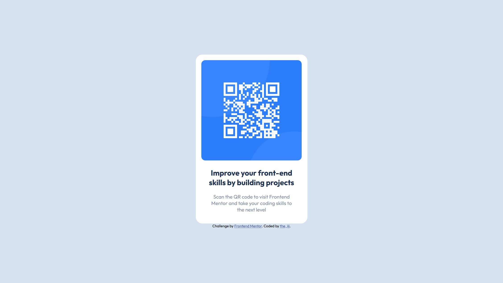

# Frontend Mentor | QR code component solution

This is a solution to the [QR code component challenge on Frontend Mentor](https://www.frontendmentor.io/challenges/qr-code-component-iux_sIO_H). Frontend Mentor challenges help you improve your coding skills by building realistic projects. 

## Table of contents

- [Overview](#overview)
  - [Screenshot](#screenshot)
  - [Links](#links)
- [My process](#my-process)
  - [Built with](#built-with)
  - [What I learned](#what-i-learned)
  - [Continued development](#continued-development)
  - [Useful resources](#useful-resources)
- [Author](#author)
- [Acknowledgments](#acknowledgments)

### Links

- Live Site URL: [Add live site URL here](https://your-live-site-url.com)

## My process

I thought to use CSS Flexbox, but CSS Grid seemed more intuitive for simply centering the items (after min-height: 100svh);

After setting up the necessary variables, I got to estimating the sizings of the various components. I wanted to use other units like rem or % but decided to limit myself to px (following the body's default font-size { 15px; }). Contrary to what I expected, I noticed the mobile design didn't transform at all after comparing the given designs in Photos.

After that, it was a bunch of trial-and-error and switching back and forth various pixel sizes for the padding of the container ".challenge". That, and some panic at the beginning, but it was fairly smooth-sailing after I got all of the HTML elements written in.

### Built with

- Semantic HTML5 markup
- CSS custom properties
- CSS Grid

### What I learned

While I didn't learn new code per say, I think this experience will come a long way in settling my nerves and getting me ready for my next project. I'm eager to try out the next challenge!

## Author

- Website - [the_iii](https://thethirdremegio.github.io/Frontend-Mentor-QR-Code-Component/)
- Frontend Mentor - [@TheThirdRemegio](https://www.frontendmentor.io/profile/TheThirdRemegio)

## Acknowledgments

Thank you, mom, for motivating me and always pushing me in the right direction.

Thanks a lot to Frontend Mentor for encouraging me and others to dip their toes into the initially-intimidating waters of development, so to speak. I was more nervous than I thought, as this was my first experience having someone give me a design to code, so this experience will do wonders for preparing me for my next challenges and projects!

Thanks also to Reddit's programming community who recommended Frontend Mentor time and time again.

### Until next time! 👋
